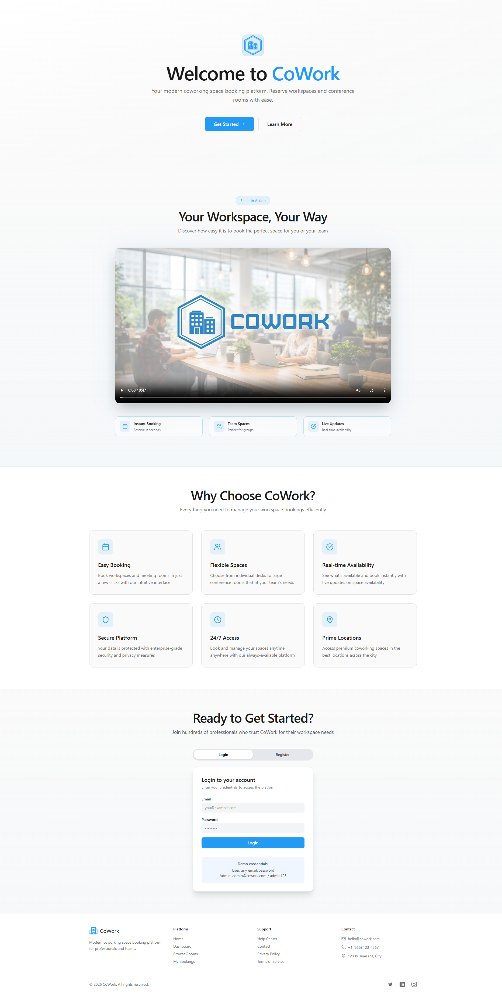
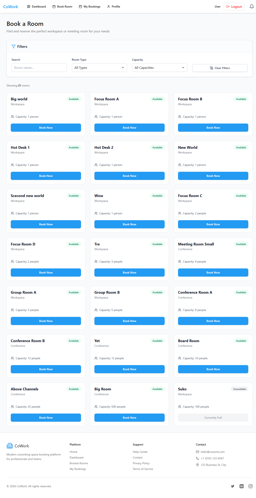

# 🏢 CoWork — Coworking Space Booking Platform 2026

> ⚡ A high-performance, full-stack booking platform for modern workspaces, featuring real-time availability and secure PostgreSQL-level reservation logic.

---

## 📚 Table of Contents

1. [🧩 Overview](#-overview)
2. [📦 Tech Stack](#-tech-stack)
3. [✨ Functional Requirements](#-functional-requirements)
4. [📡 API Specification](#-api-specification)
5. [🗄️ Database Schema](#️-database-schema)
6. [📁 Directory Structure](#-directory-structure)
7. [🎨 Visual Preview](#-visual-preview)
8. [🧰 Installation & Setup](#-installation--setup)
9. [👨‍💻 Author](#-author)
10. [📜 License](#-license)

---

## 🧩 Overview

CoWork is a professional booking solution designed for coworking spaces. It bridges the gap between sleek user experience and robust data integrity. By utilizing Socket.io for real-time notifications and PostgreSQL GIST constraints, it ensures that a desk or conference room is never double-booked, providing a seamless flow for both users and administrators.

---

## 📦 Tech Stack

### 🖥️ Frontend

- **React + Vite** — Lightning-fast development and optimized production builds.
- **Context API** — Centralized state management for user sessions and real-time alerts.
- **Axios & Socket.io Client** — Seamless data fetching and live event listening.

### ⚙️ Backend

- **Node.js & Express** — Scalable RESTful API architecture.
- **JWT & bcrypt** — Industry-standard security for authentication and password hashing.
- **Supabase (PostgreSQL)** — Relational data storage with advanced exclusion constraints.

---

## ✨ Functional Requirements

### 👥 User Roles

- **Standard User** — Browse available rooms, manage personal dashboard, and create/cancel reservations.
- **Administrator** — Full control over room inventory, view system-wide analytics, and manage user accounts.

### 🛠️ Core Features

- **Smart Validation** — Uses `tstzrange` to prevent overlapping bookings directly at the database level.
- **Real-time Updates** — Users see room status changes immediately without refreshing the page via WebSockets.

---

## 📁 Directory Structure

```
KursProject2026Backend/
├── backend/
│   ├── config/          # Supabase & DB connection
│   ├── middleware/      # JWT Auth & RBAC logic
│   ├── routes/          # API Endpoint definitions
│   └── server.js        # Entry point
└── frontend/
    ├── src/
    │   ├── components/  # Reusable UI & Admin tools
    │   ├── context/     # Global state & Sockets
    │   ├── pages/       # Dashboard & Login views
    │   └── services/    # API & Socket initialization
```

---

## 🎨 Visual Preview

### 🏠 HomePage


### 📅 User Reservations


### 🔐 Admin Management


---

## 🧰 Installation & Setup

### 1️⃣ Setup Backend

```bash
cd backend
npm install
# Configure .env with SUPABASE_URL and SUPABASE_KEY
npm start
```

### 2️⃣ Setup Frontend

```bash
cd frontend
npm install
npm run dev
```

---

## 👨‍💻 Author

**Sukhawat Charoenchit**
👨‍💻 Full Stack Dev Student &nbsp;|&nbsp; 🏫 Företagsuniversitetet &nbsp;|&nbsp; 📍 Sthlm

✨ *Exploring the intersection of real-time systems and clean UI architecture.*

---

## 📜 License

This project is licensed under the **MIT License**.

© 2026 dev-sukhawat

---

💫 *Thanks for checking out CoWork. Keep building and stay creative!* 🚀
